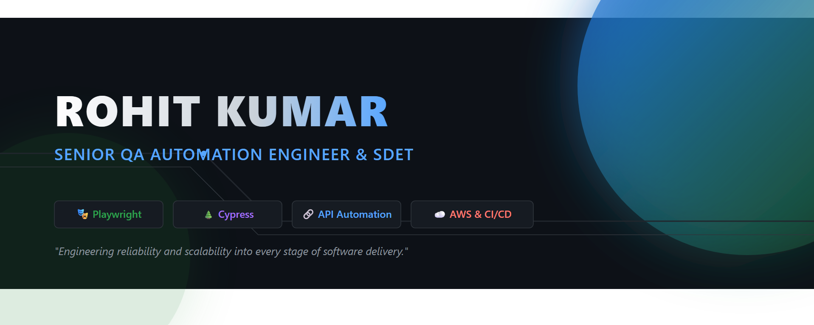

  
  
  

<h1 align="center">Hi 👋 I'm Rohit Kumar</h1>
<h4 align="center">📍 Bengaluru, India</h4>

Helping engineering teams deliver reliable, scalable, and high-quality software through modern test automation, cloud-native engineering, DevOps, and AI-assisted quality practices.

  
  
  
  

---

## 💼 About Me

I'm a **Senior QA Automation Engineer** with **11+ years of experience** designing scalable automation frameworks that improve software quality and accelerate delivery. 

My expertise spans UI automation, API testing, cloud-native quality engineering, and AI-assisted testing using modern tools such as Playwright, Cypress, Selenium, GitHub Copilot, and AWS. I focus on reducing feedback cycles and helping engineering teams ship reliable software faster.

## ⚡ Quick Highlights

| Experience | Certifications | Specialization |
|------------|----------------|----------------|
| 11+ Years | AWS Certified Developer | Playwright • Cypress • Selenium |
| 92% Automation Coverage | GitHub Copilot Certified | API • CI/CD • AWS |
| 75% Faster Regression | M.Tech – BITS Pilani | AI-assisted Testing |

## 🎯 I Specialize In

* **Playwright Automation**
* **Cypress Automation**
* **Selenium WebDriver**
* **REST API Automation**
* **AI-assisted Test Automation**
* **AWS Cloud Testing**
* **CI/CD Automation**
* **Docker & Kubernetes**
* **Automation Framework Architecture**
* **Technical Mentoring & Coaching**

## 🏢 Domain Experience

* Banking & Financial Services
* Retail & E-commerce
* Logistics & Transportation
* Semiconductor Manufacturing
* Enterprise Asset Management (IBM TRIRIGA)

## 🏅 Certifications

## 🎓 Education

**Master of Technology (M.Tech.) – Software Engineering**  
BITS Pilani

**Bachelor of Computer Applications (B.C.A.)**  
Magadh University

---

## 🚀 Core Skills

| Category | Technologies |
| :--- | :--- |
| **Test Automation** | Playwright, Cypress, Selenium WebDriver |
| **Framework Design** | Scalable Automation Frameworks, Hybrid Frameworks, POM, Data-Driven Testing |
| **Programming** | Java, JavaScript, TypeScript |
| **API Testing** | REST Assured, Postman |
| **CI/CD** | GitHub Actions, Azure DevOps, Jenkins |
| **Cloud** | AWS |
| **Containers** | Docker, Kubernetes |
| **Version Control** | Git, GitHub |
| **AI** | GitHub Copilot, AI-assisted Test Automation |
| **Quality Engineering** | Test Strategy, Regression Automation, Cross-browser Testing, Test Reporting |

## 💻 Key Technologies

## 🏆 Key Achievements

* **Designed and built** enterprise-grade automation frameworks from scratch for multiple enterprise applications.
* **Reduced manual testing effort by 65%** through scalable UI and API automation.
* **Reduced regression execution time by 75%**, enabling faster release cycles.
* **Increased automation coverage to 92%** across multiple enterprise applications.
* **Improved UI defect detection by 50%** through robust automation strategies.
* **Accelerated CI/CD validation cycles by 70%** with automated quality gates.
* **Reduced flaky test failures by 65%** using framework improvements and stability enhancements.

## 🤝 Leadership & Engineering Impact

* Mentored 12+ automation engineers on framework design and testing best practices.
* Built enterprise automation frameworks adopted across multiple teams.
* Integrated automated quality gates into CI/CD pipelines.
* Collaborated with developers, product owners, and business stakeholders to improve release quality.
* Promoted shift-left testing and automation-first engineering practices.

---

## 🚀 Projects I'm Currently Building

| Project | Status |
|:---|:---|
| Enterprise Playwright Framework | 🚧 In Development |
| Enterprise Cypress Framework | 🚧 In Development |
| REST API Automation Framework | 🚧 In Development |
| GitHub Actions QA Templates | 🚧 In Development |

## 🔥 Currently Exploring

* AI Agents for Software Testing
* LLM Testing & Evaluation
* GitHub Copilot Agent Mode
* Model Context Protocol (MCP)
* Test Observability
* Platform Engineering for QA
* Kubernetes Test Automation
* Advanced AWS Services

---

<h2 align="center">📊 GitHub Statistics</h2>

  
  

  

## 🏆 GitHub Trophies

  

## 🐍 Contribution Snake

---

## 💬 Professional Philosophy

> *"Quality is built into software through engineering, automation, and continuous improvement."*

## ⚡ Fun Fact

I enjoy turning repetitive manual testing into scalable automation solutions and exploring how AI can help engineers build better software.

## 🤝 Let's Connect

I'm always happy to discuss:
* Test Automation
* Playwright
* AI-assisted Testing
* Cloud-native QA
* Open Source
* Career Growth in Test Automation

If my work interests you, feel free to connect on LinkedIn, explore my repositories, or collaborate on future projects.

  <h3>🚀 Building Reliable Software Through Modern Quality Engineering 🚀</h3>

  Thanks for visiting my profile! ⭐

